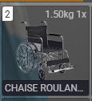
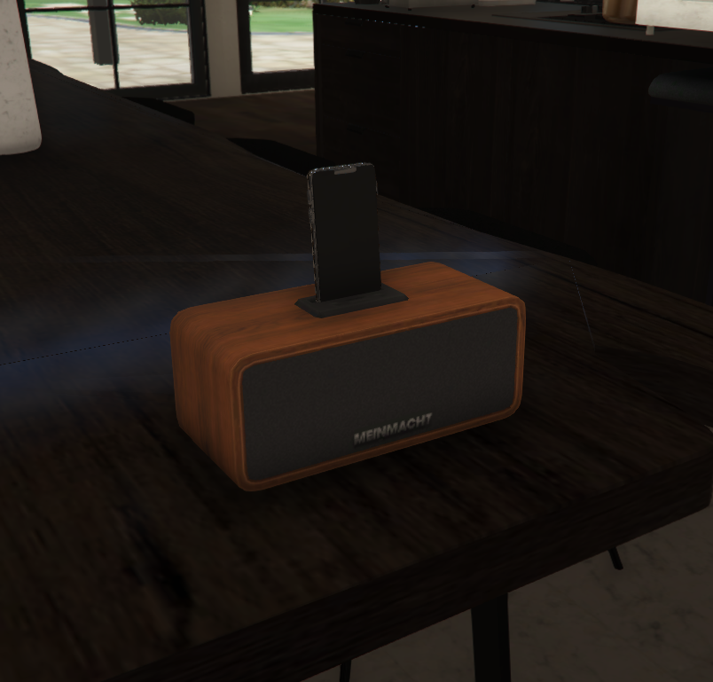

# 📢 PatchNote Edenya RP SemiWL📢
#### Version `1.0.5` le 10/02/2026 à 14:00.

## 🧠 Auteurs:
### 🛠️ Développement : WeGaSo Studio -- *(Anciennement NDC Studio)*
### 🎨 Design : Lx Design

---

### ✨ [Security-Added]
**RAPPEL:**
- Changement du systeme WL en semiWL
  - Changement de l'accès serveur, de: `whitelist approved` à: `approuved roles`  

---

### ✨ [Added]
- **cylex_animmenuv2**
  - Nouveau système d'emote remplace `rp_emote`

- **wegaso_getcops**
  - creation de la commande `get_cops` permettant aux joueurs de connaître le nombre de policiers en fonction avant de tenter une action illégale 
  - *→ Voir règlement sur discord*

- **wegaso_infobubble**
  - Un script nous permetant n'afficher une bulle customisée avec un message à des emplacements et périmètre definis
  - *Ex: Utilisée à l'entrée du concessionnaire voiture ou dans des zone en cours de modification suite à un bug etc..*

- **wegaso_fix**
  - La commande `/propfix` était fournie par `rp_emote`.
  - creation de weagaso_fix *script custom*
    - commande **/propfix** 
    - commande **/leavefix** (Si vous êtes bloqué dans une instance *feature en cours de test*)

- **wegaso_cayo_fix**
  - Il semblerait que quand le mapping n'apparait pas assez vite a la connexion on tombe sous le sol et on meurt
  - creation d'une commande /cayo_fix
  - *(fonctionne seulement si votre personnage est dans un rayon de 300m autour de la maison et sous le sol `niveau 0` )*

- **tstudio_mrpark_mrpd**
  - Mapping du poste de police mission row + modification des points d'interactions du poste

- **wegaso_vehicle_item**
  - Ajout de la chaise roulante en item.. *(c'est un objet à but médical ne l'oubliez pas!)*
  - *Et fatalement je ne peux pas mettre un poid réel  ou ça vous emputera en RP donc poid fixé a 1.5kg*

- **xmmx_letscookplus**
  - Ajout de l'item `smart_speaker` *( un petit speaker avec smartphone qu'on utilise comme la boombox et l'enceinte )*

- **ox_inventory/crafting**
  - Point de crafts sur les comptoires (restaurants, bars) changer les bouteilles du vigneron en verres
  - *1 bouteille + 5 verres vides = 5 verres pleins*

---

### 🩹 [Fixed]
- **slaphorse**
  - Suite au changement illenium quand on descendait du cheval, on devenait le cheval.. *(Tout va bien maintenant)*

- **core_mechanic**
  - *Je deteste ce script*
  - Plus besoin de restart le script a chaque connexion d'un mécanicien les swaps persistes et nous n'avons plus vraiment de problèmes avec
  - *Je passe par là pour rappeller que nous aimerions ne pas vous voir à 350 km/h avec des swaps du futur, restez logiques dans vos modifications*

---

### 🔄 [Changed]
- **ox_cbd** - Nouvelle boisson pour remplacer le Thé à la cbd "doublon" craft/fournisseur.

---

### ⬆️ [Updated]
- **gksphone** *(Mise à jour et ajout de nouveautés)*
- **ak47_ambulancejob** *(Correction des crashs intempestifs)*
- **rcore_casino** *(Correction des crashs intempestifs)*
- **cd_garage** *(Correction de la persistance)*
- **rtx_carradio** *(Lecture youtube impossible fixed)*
- **core_mechanic** *(Fix le besoin de redémarrage intempestif)*
- **artifacts FiveM** *(manipulation habituelle)*

---

### ❌ [Removed]
- **rp_emote**
- **wasabi_boombox**
- **Plusieurs MLO de maisons à acheter**
  - Afin d'optimiser le server **Rem** n'installe la maison que si elle est achetée par un personnage afin de ne pas avoir 20 mappings inutilisés en ville.

---

### ↓ Prochainement ↓

- **ox_inventory/shops**
  - Disponibilité de la chaise roulante à la pharmacie
  - Disponibilité du petit speaker pour smartphone (s'utilise comme les enceintes et boombox)

- **péremption des aliments**
  - J'ai fait des essais sur le burger du 24/7 et les aliments du BShot.
  - **C'est un succès!** Nous allons donc rendre tout les aliments périmables sur le serveur!
    - Ingrédients → 1 semaine
    - Consommables → 48h
    - Bocaux et Conserves → 2 semaines
    - Plats préparés → 2 semaines
    - Boissons → 2 semaines
    - Poisson de pêche → 48h
    - Viandes de chasse → 72h
    - Peaux de chasse → 72h | *illegal*
      - *(possible ajout d'un craft illégal pour transformer les peaux en cuir avec une peremption de 1 semaine et une vente de cuir illegale)*
    - Les organes → 24h | *illegal → voir reglement sur discord*
  - *Les péremptions de 2 semaine ça pourrait être 1 semaine dépendemment de ox_inventory si il permet de mettre des longues durées*

- **liste de véhicules blacklisted au swap**
  - Etant donné certains abus de swp je vais mettre en place une liste de véhicules de swaps autorisés ou non
  - Si le script ne permet pas de black-lister des véhicules les mécaniciens devront se référer à la liste avant d'effectuer un swap sur un véhicule
  - *(il se peut que j'augmente le prix des swaps, par logique des modifications de ce type coutent plus cher qu'une simple cartographie moteur)*
